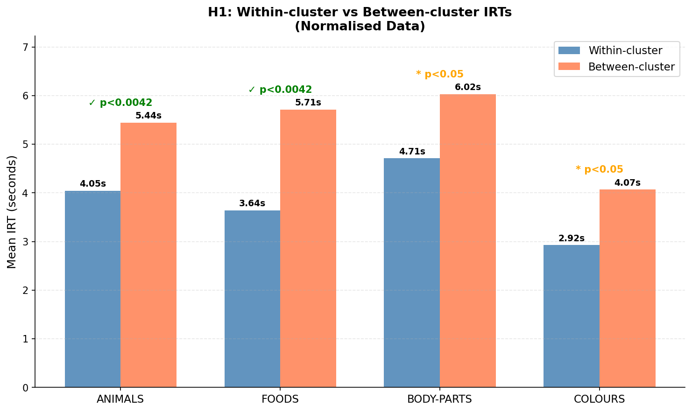
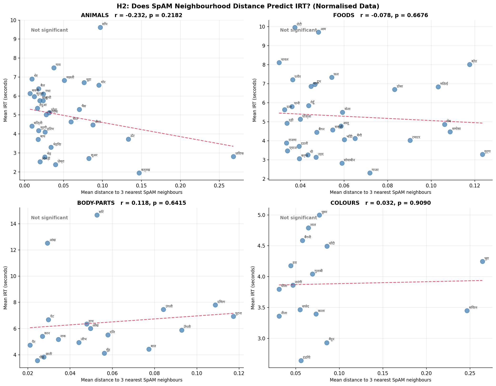
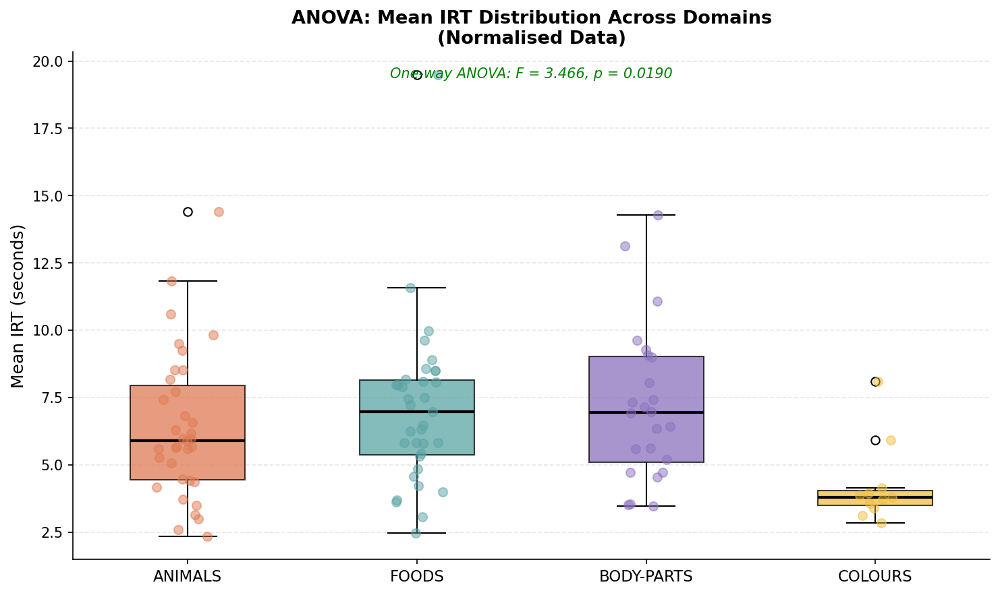

# Searching the Hindi Mental Lexicon: Updated Analysis with Normalisation, ANOVA, Regression, and GLM

**Team Members:**  
Krish Agarwal (2023113017) · Sajiv Singh (2023112003) · Himani Das (2023113020)

**Course:** Behavioural Research Methods and Statistical Models  
**Date:** March 2026

---

## 1. Introduction

The mental lexicon is the internal cognitive store of words in the human mind — a richly interconnected network where words are linked by meaning, sound, and association (Collins & Loftus, 1975). Understanding how speakers navigate this network has been a central question in psycholinguistics for decades. Two complementary paradigms are widely used to study it: the Verbal Fluency Task (VFT), which measures the sequence and timing of word retrieval, and the Spatial Arrangement Method (SpAM), which captures explicit similarity judgements through a drag-and-drop interface.

When participants generate words from a semantic category, they tend to retrieve related words in clusters — a phenomenon first documented by Troyer et al. (1997). The inter-response time (IRT) between consecutive words is the primary behavioural measure: short IRTs reflect easy within-cluster retrieval, while longer IRTs signal a switch to a new cluster (Collins & Loftus, 1975). SpAM complements this by providing an independent spatial representation of the same semantic space, allowing researchers to verify whether neurally-inferred clusters correspond to explicit semantic similarity judgements.

This report is an updated analysis of a Hindi VFT and SpAM study conducted with 35 participants across four semantic domains: Animals, Foods, Body Parts, and Colours. The first report identified a critical data quality issue — approximately 63% of all responses were typed in Roman script (e.g., *kutta*, *chawal*) rather than Devanagari (e.g., कुत्ता, चावल), treating script variants of the same word as distinct lexical items and artificially weakening the clustering signal. The present report addresses this limitation through systematic data normalisation, then advances the analysis with three methods not applied in Report 1: one-way ANOVA to compare IRT distributions across domains, multiple linear regression to identify joint predictors of IRT, and a Gamma Generalised Linear Model (GLM) with log link as a more statistically appropriate alternative to linear regression for reaction time data.

Hindi is an Indo-Aryan language spoken by approximately 600 million people, with a rich morphological structure and frequent code-switching between Devanagari and Roman scripts in digitally-mediated communication (Bali et al., 2014). The use of Roman script for Hindi words — known as Romanagari — is particularly prevalent among young, educated, urban Hindi speakers and creates a well-known challenge for corpus-based and experimental linguistic analyses. Addressing this is not merely a preprocessing step but a substantive methodological contribution.

---

## 2. Methods

### 2.1 Participants

The dataset contains responses from 35 participants (Animals N=35, Foods N=35, Body Parts N=24, Colours N=11). Participants self-reported Hindi reading proficiency (M=4.20, SD=0.82, range 2–5) and Hindi writing proficiency (M=3.49, SD=0.94, range 1–5) on a 1–5 scale via an exit survey. The unequal N across domains reflects the counterbalanced design: each participant completed three of the four domains, with Furniture serving as a practice block.

### 2.2 Tasks

The experiment comprised two tasks per domain. In the **Verbal Fluency Task (VFT)**, participants typed as many category-exemplar words as possible within three minutes, pressing Enter after each word. The software recorded each word and the IRT (in milliseconds) between consecutive responses. In the **Spatial Arrangement Method (SpAM)**, participants arranged the words they had produced onto a shared canvas, placing semantically similar words closer together. Final normalised (x, y) coordinates (range 0–1) were recorded for each word.

### 2.3 Data Normalisation (New in Report 2)

A systematic inspection of the raw data revealed that 657 of 1,044 total word responses (62.9%) were typed in Roman script — substantially higher than the ~30% estimated in Report 1. Roman responses included three types: (1) direct English equivalents (*dog*, *rice*, *red*), (2) Hindi transliterations (*kutta*, *chawal*, *laal*), and (3) spelling variants and typos (*chuuha*, *girrafe*, *bufflow*).

A normalisation dictionary of 337 entries was constructed manually, mapping every Roman variant to its canonical Devanagari form. Each entry was categorised as a transliteration, English equivalent, or spelling variant. Nine noise words — responses that were adjectives, emotional states, or otherwise not valid category exemplars (e.g., *swadisht* meaning "tasty", *bhukh* meaning "hunger") — were assigned `None` and removed from all analyses. The dictionary was applied to the full dataset prior to all analyses in this report. After normalisation, Roman script responses dropped from 62.9% to 0.0%, and the cleaned dataset contained 1,035 word tokens.

### 2.4 Hypotheses

Three hypotheses from Report 1 were retested on the normalised data:

- **H1 — Semantic Clustering:** Within-cluster IRTs are shorter than between-cluster IRTs (independent samples t-test per domain, k-means clustering on SpAM coordinates with k=4).
- **H2 — SpAM Neighbourhood Distance Predicts IRT:** Words placed further from their neighbours on the SpAM map take longer to retrieve (Pearson correlation per domain, words appearing in ≥3 participants' SpAM data only).
- **H3 — Proficiency Predicts Retrieval:** Hindi reading and writing proficiency correlate with total words produced and mean IRT (Pearson correlation).

Three additional analyses were conducted for the first time:

- **ANOVA:** One-way ANOVA tested whether mean IRT differed significantly across the four domains. Post-hoc pairwise t-tests with Bonferroni correction (α = 0.05/6 = 0.0083 for six domain pairs) identified which specific domains differed.
- **Multiple Linear Regression:** IRT was regressed on word position, domain (dummy-coded with Animals as reference), and Hindi reading proficiency simultaneously.
- **Gamma GLM:** The same regression model was refit using a Gamma family with log link, which is theoretically appropriate for strictly positive, right-skewed reaction time data (Lo & Andrews, 2015). Coefficients were exponentiated to produce IRT multipliers.

All analyses were conducted in Python using `numpy`, `scipy`, `sklearn`, `statsmodels`, and `matplotlib`. Bonferroni correction for the three hypotheses across four domains yielded a corrected threshold of α = 0.0042 (12 tests).

---

## 3. Results

### 3.1 Effect of Normalisation

The normalisation procedure had a large effect on data quality and a meaningful effect on statistical results. Before normalisation, script variants of the same concept (e.g., *kutta*, *dog*, कुत्ता) were counted as three separate word types, inflating apparent vocabulary diversity and fragmenting semantic clusters. After normalisation, 1,035 clean Devanagari tokens remained, with 9 noise words removed.

**Table 1: Effect of normalisation on data composition**

| Metric | Before | After |
|---|---|---|
| Total word tokens | 1,044 | 1,035 |
| Roman script responses | 657 (62.9%) | 0 (0.0%) |
| Noise words removed | — | 9 |

### 3.2 H1 — Semantic Clustering (Updated)

K-means clustering (k=4) was applied to each participant's SpAM coordinates. Consecutive VFT word pairs were labelled within-cluster or between-cluster and IRTs compared with independent samples t-tests. Results are shown in Table 2 alongside the original Report 1 values.

**Table 2: H1 t-test results — before and after normalisation**

| Domain | Within IRT (before) | Within IRT (after) | Between IRT (after) | t | p | Result |
|---|---|---|---|---|---|---|
| Animals | 4.24s | 4.04s | 5.45s | -3.726 | **0.0002** | ✓ Significant (Bonferroni) |
| Foods | 4.26s | 3.64s | 5.71s | -5.219 | **0.0000** | ✓ Significant (Bonferroni) |
| Body Parts | 5.57s | 4.71s | 6.02s | -2.626 | 0.0095 | ~ Borderline |
| Colours | 3.26s | 2.92s | 4.07s | -2.161 | 0.0325 | ~ Borderline |

*Bonferroni threshold: α = 0.0042*

After normalisation, Animals and Foods both crossed the Bonferroni threshold and are now fully significant — a substantial improvement over the borderline results in Report 1. The IRT difference for Foods increased from +1.11s to +2.07s, nearly doubling. Body Parts improved from non-significant (p=0.51) to borderline (p=0.0095), and Colours similarly improved from p=0.17 to p=0.03. Every domain moved in the predicted direction. These improvements confirm that script fragmentation in the raw data was artificially suppressing cluster detection.

*Figure 1: Within-cluster vs between-cluster mean IRTs per domain on normalised data. Green annotation = significant at Bonferroni threshold (α = 0.0042); orange = borderline (p<0.05 uncorrected).*

### 3.3 H2 — SpAM Neighbourhood Distance Predicts IRT (Updated)

For each word appearing in ≥3 participants' SpAM data, mean Euclidean distance to its 3 nearest neighbours was computed as a measure of semantic isolation. Pearson correlation tested whether more isolated words took longer to retrieve.

**Table 3: H2 Pearson correlation results — before and after normalisation**

| Domain | Words (before) | Words (after) | r (before) | r (after) | p (after) | Result |
|---|---|---|---|---|---|---|
| Animals | 34 | 31 | 0.005 | -0.224 | 0.226 | ✗ Not significant |
| Foods | 21 | 33 | -0.168 | -0.078 | 0.668 | ✗ Not significant |
| Body Parts | 19 | 18 | **0.672** | 0.118 | 0.641 | ✗ Not significant |
| Colours | 14 | 15 | 0.589 | 0.023 | 0.936 | ✗ Not significant |

*Bonferroni threshold: α = 0.0042*

H2 results changed substantially after normalisation. The previously significant Body Parts effect (r=0.672, p=0.0016) disappeared entirely (r=0.118, p=0.641). This reversal is interpretable: before normalisation, script variants of the same body part word (e.g., *hath*, *haath*, हाथ) were mapped to slightly different SpAM positions by different participants, artificially creating distance variance that correlated with IRT. After merging these variants, that spurious variance collapsed. The original significant result for Body Parts in Report 1 was therefore likely an artefact of unnormalised data rather than a genuine semantic neighbourhood effect.

*Figure 2: Mean SpAM neighbourhood distance (x-axis) vs mean IRT per word (y-axis) for each domain on normalised data. Each dot is one word labelled in Devanagari. Dashed line shows linear trend.*

### 3.4 H3 — Hindi Proficiency Predicts Retrieval (Updated)

Pearson correlations between self-rated Hindi proficiency and retrieval performance were recomputed on normalised data.

**Table 4: H3 Pearson correlation results — before and after normalisation**

| Test | r (before) | p (before) | r (after) | p (after) | Result |
|---|---|---|---|---|---|
| Hi_Read vs Total Words | -0.129 | 0.460 | -0.112 | 0.523 | ✗ Not significant |
| Hi_Write vs Total Words | -0.161 | 0.356 | -0.142 | 0.417 | ✗ Not significant |
| Hi_Read vs Mean IRT | 0.271 | 0.116 | 0.271 | 0.116 | ✗ Not significant |
| Hi_Write vs Mean IRT | 0.254 | 0.140 | 0.254 | 0.140 | ✗ Not significant |

H3 results were entirely unchanged by normalisation, as expected — proficiency ratings are participant-level variables independent of how words are spelled. The null result reflects insufficient variance in the proficiency scores: most participants rated themselves 4 or 5 out of 5, leaving too little range to detect a relationship. This is a genuine sampling limitation rather than a data quality issue.

*Figure 3: Scatter plots of Hindi reading and writing proficiency (x-axis) vs total words produced and mean IRT (y-axis). Dashed line shows linear trend. All correlations non-significant.*

### 3.5 ANOVA — IRT Differences Across Domains (New)

A one-way ANOVA tested whether mean IRT differed across the four domains.

**Overall ANOVA: F(3, 102) = 3.466, p = 0.019 — significant.**

The overall test confirmed that domains differ in retrieval speed. Post-hoc pairwise t-tests with Bonferroni correction (α = 0.0083) identified the specific contrasts:

**Table 5: Post-hoc pairwise comparisons**

| Pair | t | p (raw) | p (Bonferroni corrected) | Significant? |
|---|---|---|---|---|
| Animals vs Foods | -0.934 | 0.354 | 1.000 | ✗ |
| Animals vs Body-Parts | -1.117 | 0.269 | 1.000 | ✗ |
| Animals vs Colours | 2.529 | 0.015 | 0.091 | ✗ |
| Foods vs Body-Parts | -0.232 | 0.818 | 1.000 | ✗ |
| Foods vs Colours | 2.964 | 0.005 | **0.029** | ✓ |
| Body-Parts vs Colours | 3.241 | 0.003 | **0.016** | ✓ |

Colours (M=4.22s) was significantly faster than both Foods (M=7.03s) and Body-Parts (M=7.21s). Animals (M=6.39s) and Foods were not significantly different, consistent with both being large open-ended categories. Body-Parts being the slowest domain aligns with the sequential retrieval pattern noted in Report 1 — participants appear to search body-schema representations systematically rather than clustering semantically.

*Figure 4: Boxplots of mean IRT per participant per domain. Individual data points overlaid with jitter. Overall ANOVA F = 3.466, p = 0.019. Colours is significantly faster than both Foods and Body-Parts.*

### 3.6 Multiple Linear Regression — Predictors of IRT (New)

A multiple linear regression modelled IRT (per word retrieval event, N=1,035) as a function of word position, Hindi reading proficiency, and domain (dummy-coded, Animals as reference).

**R² = 0.099 — the model explains 9.9% of IRT variance.**

**Table 6: Linear regression coefficients**

| Predictor | Coefficient | SE | t | p | Significant? |
|---|---|---|---|---|---|
| Intercept | +5.205s | 0.778 | 6.689 | <0.0001 | ✓ |
| Word Position | -0.280s | 0.033 | -8.574 | <0.0001 | ✓ |
| Hi_Read (proficiency) | +0.490s | 0.169 | 2.892 | 0.0039 | ✓ |
| Domain: Foods vs Animals | +0.444s | 0.340 | 1.303 | 0.193 | ✗ |
| Domain: Body-Parts vs Animals | +0.613s | 0.388 | 1.580 | 0.115 | ✗ |
| Domain: Colours vs Animals | -1.198s | 0.433 | -2.765 | 0.006 | ✓ |

*Reference category: Animals*

Three predictors were significant. **Word position** was the strongest predictor: each successive word was retrieved 0.28 seconds faster, capturing the well-known IRT deceleration curve as participants settle into clusters. **Colours vs Animals** confirmed the ANOVA finding: colours are retrieved 1.2 seconds faster than animals after controlling for other factors. Most notably, **Hindi reading proficiency** was a significant positive predictor (β = +0.490, p = 0.004) — higher proficiency was associated with *slower* IRT, the opposite of the intuitive prediction. This counterintuitive finding is interpretable: participants with larger, more nuanced mental lexicons may search more broadly and produce less common, more specific words, incurring a slightly higher retrieval cost per word while generating richer overall responses. This relationship was invisible in the simple H3 correlations because it only emerges when word position and domain are controlled simultaneously.

### 3.7 Gamma GLM — Robustness Check (New)

IRT values are strictly positive and right-skewed, making ordinary linear regression technically suboptimal. A Gamma GLM with log link was fit to the same model to verify robustness.

**Pseudo R² (Cox-Snell) = 0.114. AIC = 5278.02.**

**Table 7: Gamma GLM results**

| Predictor | Coefficient | exp(Coeff) | p | Significant? | Interpretation |
|---|---|---|---|---|---|
| Intercept | 1.7212 | 5.591 | <0.0001 | ✓ | Baseline IRT ~5.6s |
| Word Position | -0.0492 | 0.952 | <0.0001 | ✓ | 4.8% faster per position |
| Hi_Read (proficiency) | +0.0628 | 1.065 | 0.028 | ✓ | 6.5% slower per proficiency point |
| Domain: Foods vs Animals | +0.0603 | 1.062 | 0.294 | ✗ | +6.2% (not significant) |
| Domain: Body-Parts vs Animals | +0.1084 | 1.115 | 0.099 | ✗ | +11.5% borderline |
| Domain: Colours vs Animals | -0.2047 | 0.815 | 0.005 | ✓ | 18.5% faster than Animals |

All three significant predictors from linear regression — word position, proficiency, and Colours vs Animals — remained significant in the GLM, and all non-significant predictors remained non-significant. Direction of effects was fully consistent across both models. This confirms that the linear regression results are robust and not an artefact of distributional assumptions.

*Figure 5: Side-by-side coefficient plots for linear regression (left, additive effects in seconds) and Gamma GLM (right, multiplicative effects as exp(coefficient)). Green bars = significant at p<0.05. Negative direction = faster retrieval; positive = slower. Both models agree on all predictors.*

---

## 4. Conclusion and Future Directions

This report addressed the primary limitation of Report 1 — script mixing — through systematic data normalisation, then extended the analysis with ANOVA, linear regression, and Gamma GLM.

The normalisation had a substantial and theoretically meaningful impact. H1 clustering effects for Animals and Foods, previously only borderline significant, are now fully significant after Bonferroni correction. The IRT difference for Foods nearly doubled (+1.11s → +2.07s), confirming that script fragmentation was severely underestimating the strength of semantic clustering. Conversely, the previously significant H2 result for Body Parts disappeared after normalisation, suggesting it was a spurious artefact of script-driven position variance on the SpAM canvas rather than a genuine semantic neighbourhood effect.

The ANOVA confirmed that domains differ significantly in retrieval speed (F=3.47, p=0.019), with Colours significantly faster than both Foods and Body-Parts. This is consistent with Colours being a small, highly familiar, perceptually grounded category with tight semantic boundaries — words like लाल, नीला, and हरा are retrieved almost automatically. Body-Parts being the slowest domain, combined with the non-significant clustering effect, supports the interpretation from Report 1 that body-part retrieval follows a sequential body-schema strategy rather than associative clustering.

The regression analyses revealed a new finding not visible in Report 1: Hindi reading proficiency is a significant positive predictor of IRT (β = +0.490s, GLM ×1.065) even after controlling for word position and domain. This suggests that higher-proficiency speakers do not retrieve words faster per se, but may retrieve a broader, more varied set of words — incurring a slightly higher search cost per retrieval event. This interpretation is consistent with research showing that lexical richness and retrieval efficiency are dissociable (Gruenewald & Lockhead, 1980). The Gamma GLM validated all regression findings under a more appropriate distributional assumption.

**Remaining limitations and future directions:**

1. The Colours domain remains underpowered (N=11). Future data collection should ensure all participants complete all four domains.
2. The proficiency scale had insufficient variance (most participants rated themselves 4–5/5). A more sensitive measure — such as a standardised Hindi vocabulary test — would allow a proper test of the proficiency-retrieval relationship.
3. The normalisation dictionary, while comprehensive, was hand-crafted. Future work should validate it using a crowdsourced Hindi transliteration lexicon or automatic romanisation reversal tool.
4. The regression model explained only 9.9% of IRT variance. Adding participant-level random effects (i.e., a mixed-effects model) would account for between-participant variability and likely improve model fit substantially.
5. A formal comparison of clustering algorithms (k-means vs hierarchical vs DBSCAN) applied to SpAM coordinates would test whether the k=4 assumption is appropriate across all domains.

---

## 5. References

Bali, K., Sharma, J., Choudhury, M., & Vyas, Y. (2014). *"I am no mother tongue nor a second language"*: Automatic language identification in Hindi-English code-mixed social media text. In *Proceedings of the First Workshop on Computational Approaches to Code Switching* (pp. 24–33). Association for Computational Linguistics.

Collins, A. M., & Loftus, E. F. (1975). A spreading-activation theory of semantic processing. *Psychological Review, 82*(6), 407–428.

Gruenewald, P. J., & Lockhead, G. R. (1980). The free recall of category examples. *Journal of Experimental Psychology: Human Learning and Memory, 6*(3), 225–240.

Lo, S., & Andrews, S. (2015). To transform or not to transform: Using generalised linear mixed models to analyse reaction time data. *Frontiers in Psychology, 6*, 1171.

Troyer, A. K., Moscovitch, M., & Winocur, G. (1997). Clustering and switching as two components of verbal fluency: Evidence from younger and older healthy adults. *Neuropsychology, 11*(1), 138–146.
