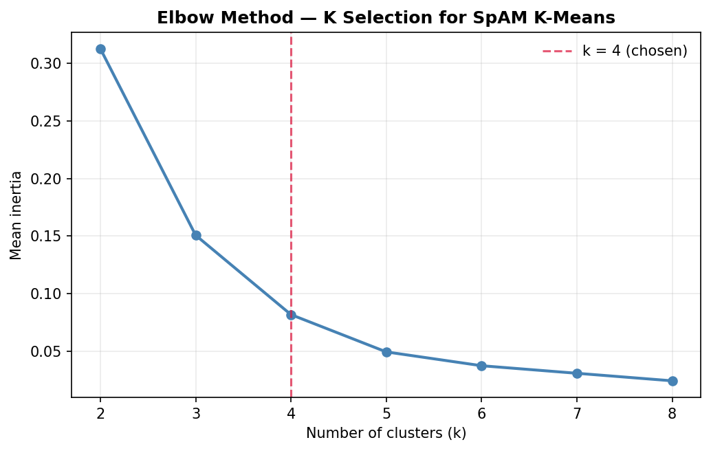
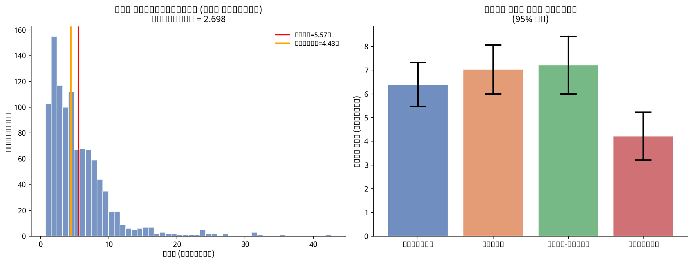
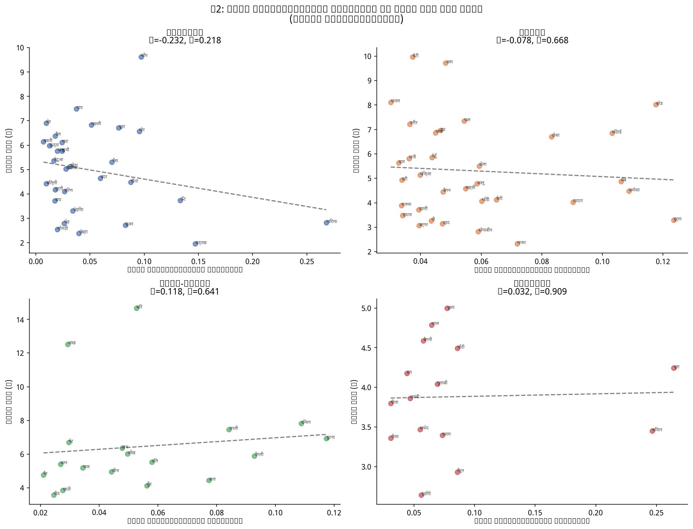
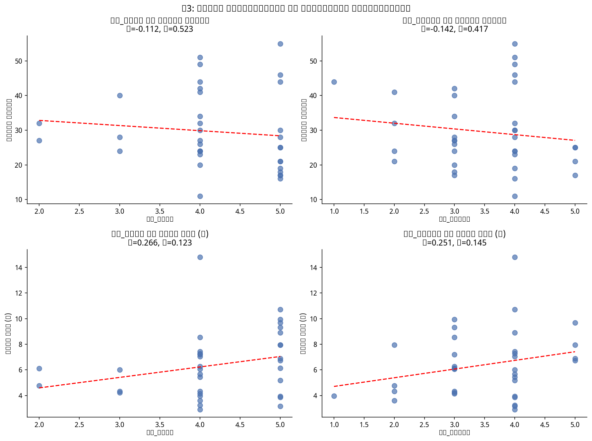
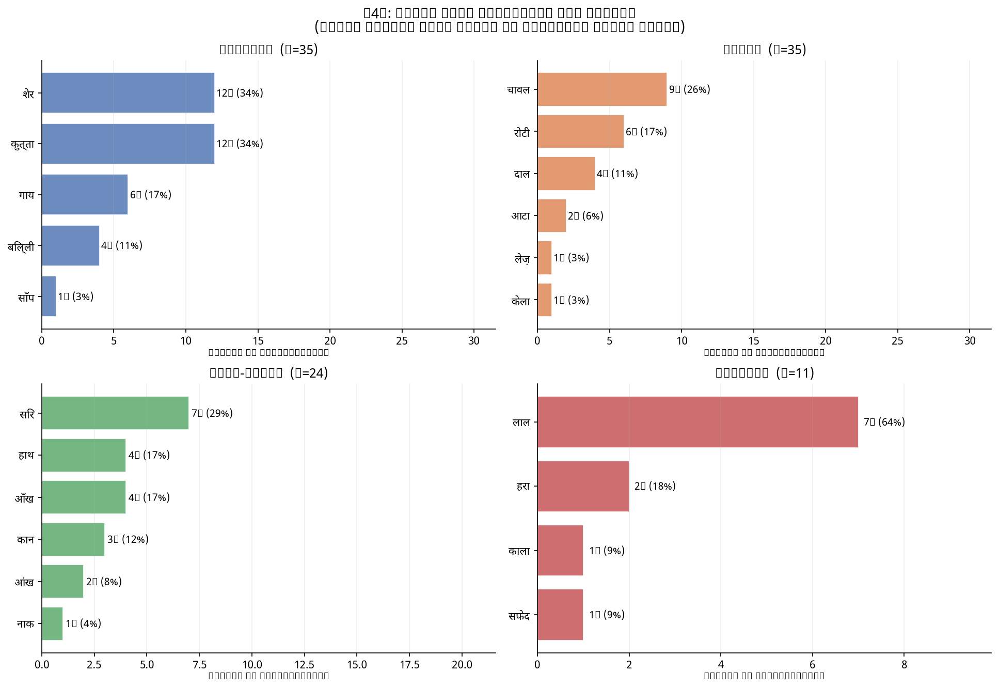
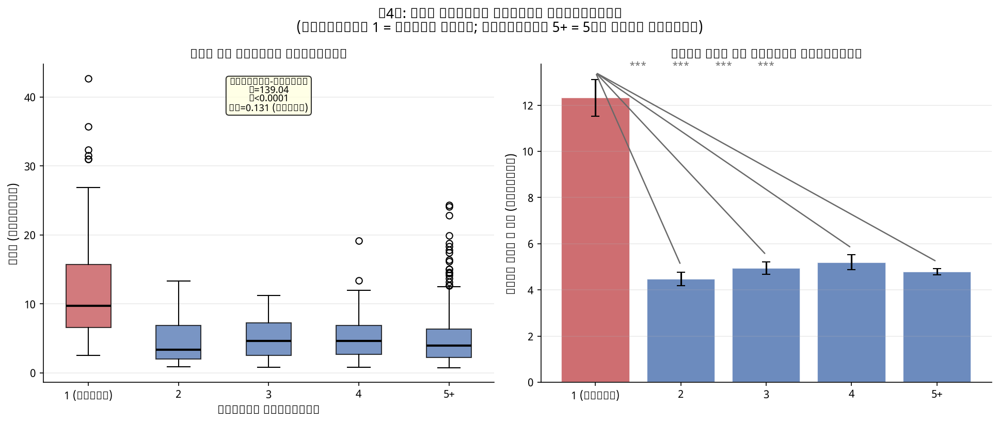
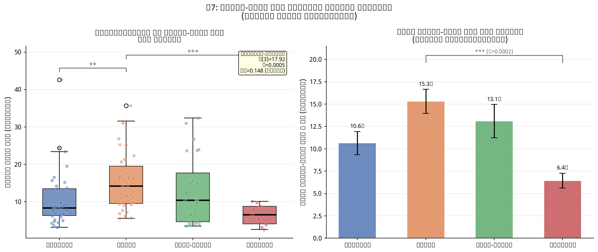
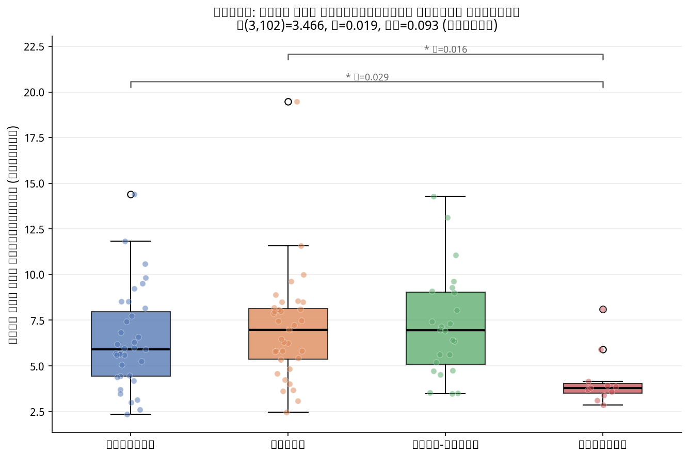
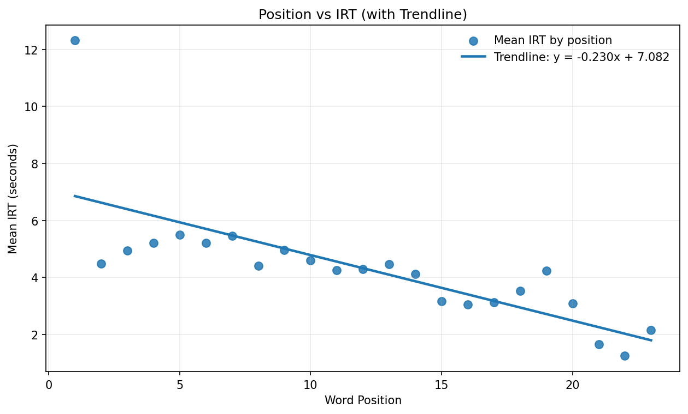
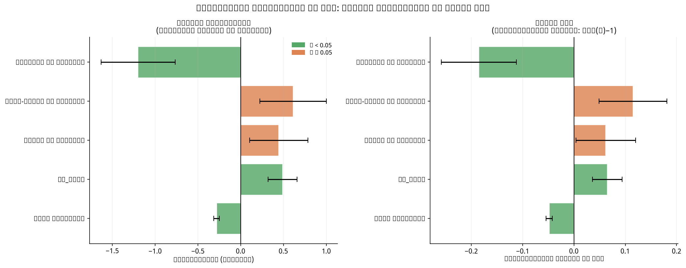

# Searching the Hindi Mental Lexicon: Updated Analysis with Normalisation, ANOVA, Regression, and GLM

**Team Members:**  
Krish Agarwal (2023113017) · Sajiv Singh (2023112003) · Himani Das (2023113020)

**Course:** Behavioural Research Methods and Statistical Models  
**Date:** April 2026

---

## 1. Introduction

The mental lexicon is the internal cognitive store of words in the human mind — a richly interconnected network where words are linked by meaning, sound, and association (Collins & Loftus, 1975). Understanding how speakers navigate this network has been a central question in psycholinguistics for decades. Two complementary paradigms are widely used to study it: the Verbal Fluency Task (VFT), which measures the sequence and timing of word retrieval, and the Spatial Arrangement Method (SpAM), which captures explicit similarity judgements through a drag-and-drop interface.

When participants generate words from a semantic category, they tend to retrieve related words in clusters — a phenomenon first documented by Troyer et al. (1997) and replicated across a range of populations and categories (Gruenewald & Lockhead, 1980). The inter-response time (IRT) between consecutive words is the primary behavioural measure: short IRTs reflect easy within-cluster retrieval, while longer IRTs signal a switch to a new cluster (Collins & Loftus, 1975). Within each cluster, retrieval tends to begin with the most typical or prototypical exemplar — the word most strongly associated with the category label — before moving to less typical members (Rosch, 1975). SpAM complements this by providing an independent spatial representation of the same semantic space, allowing researchers to verify whether implicitly-inferred clusters correspond to explicit semantic similarity judgements.

This report is an updated analysis of a Hindi VFT and SpAM study conducted with 35 participants across four semantic domains: Animals, Foods, Body Parts, and Colours. The first report identified a critical data quality issue — approximately 63% of all responses were typed in Roman script (e.g., *kutta*, *chawal*) rather than Devanagari (e.g., कुत्ता, चावल), treating script variants of the same word as distinct lexical items and artificially weakening the clustering signal. The present report addresses this through systematic data normalisation, then advances the analysis with three methods not applied in Report 1: one-way ANOVA to compare IRT distributions across domains, multiple linear regression to identify joint predictors of IRT, and a Gamma Generalised Linear Model (GLM) with log link as a statistically appropriate alternative for reaction time data. Additionally, this report addresses TA feedback by including formal hypothesis statements, test justifications, assumption checks, effect sizes, outlier detection, and confidence intervals.

Hindi is an Indo-Aryan language spoken by approximately 600 million people. The use of Roman script for Hindi words — known as Romanagari — is particularly prevalent among young, educated, urban Hindi speakers and creates a well-known challenge for corpus-based and experimental linguistic analyses (Bali et al., 2014). Addressing this is not merely a preprocessing step but a substantive methodological contribution to the study of Hindi psycholinguistics.

---

## 2. Methods

### 2.1 Participants

The dataset contains responses from 35 participants (Animals N=35, Foods N=35, Body Parts N=24, Colours N=11). Participants self-reported Hindi reading proficiency (M=4.20, SD=0.82, range 2–5) and Hindi writing proficiency (M=3.49, SD=0.94, range 1–5) on a 1–5 scale via an exit survey. The unequal N across domains reflects the counterbalanced design: each participant completed three of the four domains, with Furniture serving as a practice block.

### 2.2 Tasks

The experiment comprised two tasks per domain. In the **Verbal Fluency Task (VFT)**, participants typed as many category-exemplar words as possible within three minutes, pressing Enter after each word. The software recorded each word and the IRT (in milliseconds) between consecutive responses. In the **Spatial Arrangement Method (SpAM)**, participants arranged the words they had produced onto a shared canvas, placing semantically similar words closer together. Final normalised (x, y) coordinates (range 0–1) were recorded for each word.

### 2.3 Data Normalisation (New in Report 2)

A systematic inspection of the raw data revealed that 657 of 1,044 total word responses (62.9%) were typed in Roman script — substantially higher than the ~30% estimated in Report 1. Roman responses fell into three categories: (1) direct English equivalents (*dog*, *rice*, *red*), (2) Hindi transliterations (*kutta*, *chawal*, *laal*), and (3) spelling variants and typos (*chuuha*, *girrafe*, *bufflow*).

A normalisation dictionary of 337 entries was constructed manually, mapping every Roman variant to its canonical Devanagari form. Nine noise words — responses that were adjectives, emotional states, or not valid category exemplars (e.g., *swadisht* meaning "tasty", *bhukh* meaning "hunger") — were assigned `None` and removed from all analyses. After normalisation, Roman script responses dropped from 62.9% to 0.0%, and the cleaned dataset contained 1,035 word tokens.

**Table 1: Effect of normalisation on data composition**

| Metric | Before | After |
|---|---|---|
| Total word tokens | 1,044 | 1,035 |
| Roman script responses | 657 (62.9%) | 0 (0.0%) |
| Noise words removed | — | 9 |

### 2.4 Assumption Checks

Before applying parametric tests, normality and homogeneity of variance were formally tested.

**Normality (Shapiro-Wilk test):** All within-cluster and between-cluster IRT groups for H1 failed normality (all p < 0.05), which is expected for raw reaction time data that is inherently right-skewed (overall skewness = 2.698). For the ANOVA groups, Animals (W=0.943, p=0.068) and Body-Parts (W=0.933, p=0.111) satisfied normality; Foods (W=0.842, p=0.0002) and Colours (W=0.740, p=0.0016) did not.

**Homogeneity of variance (Levene's test):** All four H1 domain comparisons failed the equal-variance assumption (all p < 0.05), indicating that within-cluster and between-cluster IRT groups have unequal variances. Welch's t-test, which does not assume equal variances, was therefore used as the primary test for H1. The ANOVA groups passed Levene's test (F=1.327, p=0.270), confirming the ANOVA assumption of equal variance across domains.

**Consequence of violations:** Because both normality and equal variance were violated for H1, three tests were run in parallel: the standard t-test (reported for comparison with Report 1), Welch's t-test (primary, preferred given Levene's failure), and Mann-Whitney U (non-parametric, preferred given normality failure). Agreement across all three tests indicates robust findings.

Assumption checks specific to H4b, H5, and the ANOVA are reported within their respective results sections (3.5, 3.6, and 3.7), as these analyses require their own normality and variance checks on different subsets of the data.

### 2.5 Outlier Detection

The IQR method (1.5 × IQR rule) was applied to all IRT values per domain to identify statistical outliers. Outliers were defined as values below Q1 − 1.5×IQR or above Q3 + 1.5×IQR.

| Domain | N | Outliers | % | Upper threshold |
|---|---|---|---|---|
| Animals | 364 | 15 | 4.1% | 13.80s |
| Foods | 318 | 21 | 6.6% | 15.00s |
| Body-Parts | 206 | 11 | 5.3% | 14.91s |
| Colours | 147 | 6 | 4.1% | 9.83s |

Between 4–7% of IRT values were flagged as outliers per domain, with the most extreme value being 42.63 seconds in Animals — almost certainly a distraction event rather than a genuine retrieval time. The ANOVA was rerun after outlier removal (F=3.012, p=0.034) and remained significant, confirming that the domain effect is not driven by extreme values.

### 2.6 Hypotheses, Test Selection, and Visualisation Rationale

#### H1 — Semantic Clustering

- **H₀:** There is no difference between within-cluster IRTs and between-cluster IRTs (μ_within = μ_between)
- **H₁:** Within-cluster IRTs are significantly shorter than between-cluster IRTs (μ_within < μ_between)

**Test chosen: Welch's independent samples t-test (primary), Mann-Whitney U (robustness check)**
Welch's t-test was selected because we are comparing two independent groups — within-cluster and between-cluster word pairs — on a continuous outcome (IRT). Welch's variant was preferred over the standard t-test because Levene's test confirmed unequal variances across all domains. Mann-Whitney U was additionally run as a non-parametric robustness check given the normality violations. Bonferroni correction was applied within each hypothesis separately. For H1, there are 4 independent domain tests, giving α = 0.05/4 = 0.0125.

K-means clustering (k=4) was applied to each participant's SpAM coordinates to derive cluster labels. The choice of k=4 was theoretically motivated by the four expected semantic groupings within each domain (e.g., wild vs domestic animals, fruits vs cooked foods) and empirically confirmed using the elbow method. Mean inertia was computed across k=2 to k=8 on all 105 participant-domain SpAM subsets (Table H1-Val); the rate of inertia decrease slows markedly after k=4, identifying it as the elbow point. Each consecutive VFT word pair was then labelled within-cluster or between-cluster based on shared cluster membership.

**Table H1-Val: Elbow method — mean inertia across k=2 to 8**

| k | Mean Inertia | N subsets |
|---|---|---|
| 2 | 0.3127 | 104 |
| 3 | 0.1508 | 104 |
| **4** | **0.0819** | **99** |
| 5 | 0.0496 | 96 |
| 6 | 0.0376 | 83 |
| 7 | 0.0310 | 66 |
| 8 | 0.0245 | 55 |

*k=4 in bold — the elbow point where the rate of inertia decrease slows substantially, consistent with the theoretical choice.*

*Figure (H1 Validation): Mean inertia across k=2–8. The curve flattens after k=4, confirming it as the elbow and supporting the theoretically motivated choice.*

**Visualisation rationale:** A grouped bar chart shows mean within-cluster and between-cluster IRTs side by side per domain, directly visualising the comparison made by the t-test and allowing simultaneous inspection of direction and magnitude across all four domains.

#### H2 — SpAM Neighbourhood Distance Predicts IRT

- **H₀:** There is no linear relationship between a word's mean SpAM neighbourhood distance and its mean IRT (ρ = 0)
- **H₁:** Words placed further from their neighbours on the SpAM map take longer to retrieve (ρ > 0)

**Test chosen: Pearson correlation**
Pearson correlation was selected because both variables — neighbourhood distance and mean IRT — are continuous, and the hypothesis predicts a linear relationship. Words appearing in fewer than 3 participants' SpAM data were excluded to ensure stable mean position estimates. Bonferroni correction for H2 gives α = 0.05/4 = 0.0125 across the four domain tests.

**Visualisation rationale:** A scatter plot per domain with neighbourhood distance on the x-axis and mean IRT on the y-axis, with one dot per word and a linear trend line, is the natural visualisation for a correlation. It shows the data distribution and whether a linear trend is present, and allows identification of influential words.

#### H3 — Hindi Proficiency Predicts Retrieval

- **H₀:** There is no relationship between Hindi proficiency and retrieval performance (ρ = 0)
- **H₁:** Higher Hindi proficiency is associated with more words produced and/or shorter mean IRT (ρ ≠ 0)

**Test chosen: Pearson correlation**
Both proficiency (1–5 scale, treated as continuous) and retrieval outcomes (total words, mean IRT) are continuous variables. Four separate correlations were run — reading and writing proficiency each against total words and mean IRT. Bonferroni correction for H3 gives α = 0.05/4 = 0.0125 across the four tests.

**Visualisation rationale:** Scatter plots with trend lines for each of the four correlations allow visual assessment of the linear trend and show the distribution of proficiency scores in the sample.

#### H4 — Typicality Bias and First-Word Retrieval Cost

- **H₀a:** The first word produced in a VFT trial is selected uniformly at random from all words in the domain (no typicality bias).
- **H₁a:** High-typicality exemplars are produced disproportionately often as category entry points, reflecting systematic typicality bias in lexical access.

- **H₀b:** First-word IRT does not differ from subsequent-word IRT (μ_first = μ_subsequent).
- **H₁b:** First-word IRT is significantly longer than subsequent-word IRT (μ_first > μ_subsequent), reflecting a broad initial search phase before the semantic network is activated.

**Test chosen for H4a: Chi-square goodness-of-fit**
Under H₀a, every word in the domain vocabulary is equally likely to be produced first. The chi-square goodness-of-fit test compares the observed first-word frequency distribution against this uniform expected distribution. Bonferroni correction across 4 domains gives α = 0.05/4 = 0.0125.

**Test chosen for H4b: Kruskal-Wallis (primary), post-hoc Mann-Whitney U**
Rather than a simple two-group t-test (first vs all subsequent), IRT is compared across five serial position groups: position 1, 2, 3, 4, and 5+. This richer framing reveals not just whether position 1 differs but *where* the IRT drop-off occurs and whether any trend continues beyond position 1. A one-way ANOVA would be the natural parametric test, but IRT data violate both normality (Shapiro-Wilk p < 0.0001 for all groups) and equal variance (Levene's F = 31.44, p < 0.0001), making ANOVA assumptions untenable. Kruskal-Wallis is the non-parametric equivalent — it tests whether at least one position group has a different distribution without assuming normality or equal variance. Post-hoc Bonferroni-corrected Mann-Whitney U tests (α = 0.05/4 = 0.0125) then identify which specific positions differ from position 1.

**Visualisation rationale:** H4a is visualised as horizontal bar charts of first-word frequency per domain (one panel per domain), making it immediately clear which words dominate category entry. H4b is visualised as a boxplot of IRT distributions across serial positions 1–5+ and a bar chart of means with SE bars, directly showing the sharp IRT collapse between position 1 and position 2 and the flat plateau thereafter.

#### H5 — First-Word IRT Differs Across Domains (Domain Accessibility)

- **H₀:** Mean first-word IRT is equal across all four domains (μ_animals = μ_foods = μ_body-parts = μ_colours).
- **H₁:** At least one domain has a significantly different first-word IRT from the others, reflecting differences in how readily each domain's semantic network can be entered.

This hypothesis is distinct from the existing ANOVA (Section 3.9), which uses each participant's mean IRT across *all* words in a trial. That analysis conflates the initial unguided search with associative retrieval. H5 isolates only the first IRT per trial — a pure measure of domain accessibility from a cold start, before spreading activation has been triggered by any previous response.

**Step 1 — Assumption checks (Shapiro-Wilk + Levene's)**
Before selecting a test, normality is checked per domain with Shapiro-Wilk and homogeneity of variance across groups with Levene's test. These results dictate which test is appropriate — no test is assumed in advance.

**Step 2 — Primary test: Kruskal-Wallis**
Shapiro-Wilk confirmed non-normality in three of four domains (Animals, Foods, Body-Parts all p < 0.01), making one-way ANOVA inappropriate. Kruskal-Wallis is the non-parametric equivalent of one-way ANOVA: instead of comparing group means, it ranks all observations together and tests whether the rank distributions differ across groups. It makes no assumption about normality or the shape of the distribution. Effect size is reported as η²_KW = (H − k + 1) / (N − k), where H is the Kruskal-Wallis statistic, k is the number of groups, and N is total sample size. η²_KW is interpreted on the same benchmarks as regular η²: < 0.01 negligible, 0.01–0.06 small, 0.06–0.14 medium, > 0.14 large.

*Why not one-way ANOVA as primary?* ANOVA requires normality within each group. Even though Levene's test confirms equal variance (p=0.103), three of four groups are non-normal. ANOVA is sensitive to non-normality especially with small samples (N=11 for Colours, N=24 for Body-Parts), and using it here would risk inflated Type I error.

*Why not Welch's ANOVA?* Welch's ANOVA relaxes only the equal-variance assumption, not normality. With non-normal data, Kruskal-Wallis remains the correct choice regardless of whether variances are equal.

*Why not four pairwise t-tests directly?* Running pairwise tests without a prior omnibus test inflates the familywise error rate — with four groups and six pairs, the probability of at least one false positive at α=0.05 is 1 − 0.95⁶ = 0.26. The Kruskal-Wallis omnibus test acts as a gate: post-hoc comparisons are only conducted if the omnibus is significant.

**Step 3 — One-way ANOVA (robustness check, reported in parallel)**
ANOVA is additionally run alongside Kruskal-Wallis. If both tests agree on the reject/fail decision, the finding is robust to distributional assumptions. If they disagree, the non-parametric result takes precedence. Reporting both increases transparency and allows direct comparison with the existing ANOVA in Section 3.9.

**Step 4 — Post-hoc: pairwise Mann-Whitney U (Bonferroni α = 0.05/6 = 0.0083)**
Six domain pairs (4 choose 2) are tested. Mann-Whitney U is the appropriate non-parametric pairwise test when normality is violated. Effect size is reported as rank-biserial correlation r = 1 − (2U / n₁n₂), which ranges from −1 to +1. A positive r means the first-named group tends to have higher values (slower IRT); a negative r means the second-named group tends to be slower. Benchmarks: |r| < 0.1 negligible, 0.1–0.3 small, 0.3–0.5 medium, > 0.5 large.

**Visualisation rationale:** A boxplot with jittered individual points per domain shows the full distribution, spread, and outliers — more informative than a bar chart for non-normal data. A bar chart of means ± SE alongside it makes the absolute magnitude of differences directly readable. Significance brackets mark the post-hoc significant pairs.

#### ANOVA — IRT Differences Across Domains

- **H₀:** Mean IRT is equal across all four domains (μ_animals = μ_foods = μ_body-parts = μ_colours)
- **H₁:** At least one domain has a significantly different mean IRT from the others

**Test chosen: One-way ANOVA with Bonferroni post-hoc**
One-way ANOVA was selected because we compare means across more than two independent groups. Running multiple pairwise t-tests would inflate the Type I error rate. ANOVA controls this with a single omnibus F-test. Levene's test confirmed equal variances across domains (p=0.270), satisfying the ANOVA homogeneity assumption. Shapiro-Wilk showed that Foods (p=0.0002) and Colours (p=0.0016) deviate from normality, but ANOVA is known to be robust to normality violations when group sizes are approximately equal and the omnibus F-test is used — a well-established finding in the literature. The outlier-removed replication (F=3.012, p=0.034) further confirms robustness. Bonferroni-corrected post-hoc pairwise t-tests (α = 0.05/6 = 0.0083) identified specific differing pairs.

**Visualisation rationale:** A boxplot with overlaid individual data points shows the full distribution per domain — median, IQR, and outliers — making it more informative than bar charts for ANOVA results.

#### Regression and GLM — Predictors of IRT

- **H₀:** Word position, domain, and proficiency jointly explain no variance in IRT (all coefficients = 0)
- **H₁:** At least one predictor significantly explains variance in IRT

**Test chosen: Multiple Linear Regression + Gamma GLM**
Multiple linear regression modelled the simultaneous contribution of word position, domain (dummy-coded with Animals as reference), and Hindi reading proficiency to IRT. Dummy coding converts the four-level domain variable into three binary predictors (Foods=1/0, Body-Parts=1/0, Colours=1/0), with Animals as the baseline — meaning all domain coefficients express the difference from the Animals mean IRT when other predictors are held constant. Animals was chosen as the reference because it is the largest and most complete domain (N=35, largest vocabulary). A Gamma GLM with log link was additionally fit as a robustness check. IRT data are strictly positive and right-skewed (skewness = 2.698), violating the normality assumption of linear regression. The Gamma family is designed for positive, right-skewed continuous outcomes and is the standard recommendation for reaction time modelling (Lo & Andrews, 2015). GLM coefficients were exponentiated to produce multiplicative IRT factors.

**Visualisation rationale:** Before examining the full model, a standalone scatter plot of mean IRT by word position with a fitted regression line is provided as a univariate diagnostic, isolating the position effect before it enters the multivariate model. A horizontal coefficient plot for both the linear and GLM models side by side allows direct visual comparison of all predictors. Bar direction (left/right) shows whether each predictor speeds up or slows retrieval; bar length shows magnitude; error bars show ±1 SE; colour indicates significance.

---

## 3. Results

### 3.1 Descriptive Statistics

**Table 2: Word count and IRT summary per domain**

| Domain | N | Mean Words | SD | First Word IRT | Subsequent IRT |
|---|---|---|---|---|---|
| Animals | 35 | 10.4 | 4.6 | 10.64s | 4.83s |
| Foods | 35 | 9.1 | 4.1 | 15.30s | 4.89s |
| Body Parts | 24 | 8.6 | 3.1 | 13.09s | 5.46s |
| Colours | 11 | 13.4 | 3.4 | 6.45s | 3.72s |

First-word IRTs were consistently 2–4 times longer than subsequent IRTs across all domains, reflecting an initial broad memory search before faster cluster-based retrieval begins. IRT dropped sharply from the first to the second word and then stabilised, consistent with the spreading-activation model of lexical retrieval (Collins & Loftus, 1975).

**IRT distribution:** Overall IRT skewness = 2.698, with mean (5.57s) substantially above median (4.43s) — the classic signature of right skew. The distribution has a long tail extending to 42.63 seconds. This directly motivates the use of a Gamma GLM over linear regression.

*Figure 1: Left — Histogram of all IRT values showing substantial right skew (skewness = 2.698), with mean (red) and median (orange) marked. Right — Mean IRT per domain with 95% confidence intervals. Colours CI [3.20, 5.23] does not overlap with Foods [5.99, 8.06] or Body-Parts [6.00, 8.42], visually confirming the ANOVA post-hoc findings.*

**95% Confidence Intervals per domain:**

| Domain | N | Mean IRT | 95% CI Lower | 95% CI Upper |
|---|---|---|---|---|
| Animals | 35 | 6.39s | 5.46s | 7.32s |
| Foods | 35 | 7.03s | 5.99s | 8.06s |
| Body-Parts | 24 | 7.21s | 6.00s | 8.42s |
| Colours | 11 | 4.22s | 3.20s | 5.23s |

### 3.2 H1 — Semantic Clustering

K-means clustering (k=4) was applied to each participant's SpAM coordinates. 896 consecutive VFT word pairs were labelled within-cluster or between-cluster and compared using Welch's t-test (primary), Mann-Whitney U (robustness), and Cohen's d (effect size).

**Table 3: H1 complete results — Welch's t-test, Mann-Whitney U, Cohen's d**

| Domain | Within IRT | Between IRT | Welch t | p (Welch) | MWU p | Cohen's d | Effect | n_within | n_between |
|---|---|---|---|---|---|---|---|---|---|
| Animals | 4.05s | 5.36s | −3.607 | 0.0004 | 0.0010 | −0.399 | small | 143 | 176 |
| Foods | 3.64s | 5.72s | −5.449 | <0.0001 | <0.0001 | −0.659 | medium | 115 | 151 |
| Body-Parts | 4.71s | 5.80s | −2.406 | 0.0174 | 0.0506 | −0.376 | small | 58 | 104 |
| Colours | 2.92s | 4.07s | −2.686 | 0.0082 | 0.2106 | −0.445 | small | 41 | 95 |

*Bonferroni threshold: α = 0.0125 (0.05/4 domains).*

Animals and Foods both crossed the Bonferroni threshold across both tests — a fully robust finding. Colours crossed the Bonferroni threshold with Welch's t-test (p=0.0082 < 0.0125), though Mann-Whitney remained non-significant (p=0.21), reflecting the domain's small sample size (N=11) and likely outlier-driven parametric result. Body-Parts did not cross the Bonferroni threshold (Welch p=0.0174 > 0.0125, MWU p=0.051), though the direction is consistent with the hypothesis and the effect size is meaningful (d=−0.376, small).

Foods showed the largest effect size (Cohen's d = −0.659, medium), with an IRT difference of +2.08 seconds between cluster transitions vs within-cluster retrievals. All other domains showed small effects (d ≈ −0.38 to −0.45).

*Figure 2: Within-cluster (blue) vs between-cluster (coral) mean IRTs per domain on normalised data. Green annotation = significant at Bonferroni threshold (α = 0.0125) across both Welch's t-test and Mann-Whitney U. Orange = crosses Welch threshold only (interpret with caution). All domains show within-cluster IRTs shorter than between-cluster IRTs, consistent with the semantic clustering hypothesis.*

**Decision:**
- **Animals: Reject H₀** — Welch t=−3.607, p=0.0004; MWU p=0.0010; d=−0.399 (small). Both tests significant past Bonferroni threshold (α=0.0125). Fully robust.
- **Foods: Reject H₀** — Welch t=−5.449, p<0.0001; MWU p<0.0001; d=−0.659 (medium). Both tests significant past Bonferroni threshold. Fully robust.
- **Body-Parts: Fail to reject H₀** — Welch p=0.0174, MWU p=0.051, both above α=0.0125. The direction is consistent with the hypothesis (within IRT 4.71s < between 5.80s, d=−0.376) but does not reach the corrected threshold.
- **Colours: Reject H₀** (with caution) — Welch t=−2.686, p=0.0082, which crosses α=0.0125. However, Mann-Whitney is non-significant (p=0.21), indicating the parametric result is sensitive to outlier IRTs. The domain is also underpowered (N=11). This result should be interpreted cautiously.

### 3.3 H2 — SpAM Neighbourhood Distance Predicts IRT

For each word appearing in ≥3 participants' SpAM data, mean Euclidean distance to the 3 nearest neighbours was computed. Pearson correlation tested whether more semantically isolated words took longer to retrieve.

**Table 4: H2 Pearson correlation results — after normalisation**

| Domain | Words | r | 95% CI | p | Result |
|---|---|---|---|---|---|
| Animals | 30 | −0.232 | [−0.546, 0.140] | 0.218 | ✗ Not significant |
| Foods | 33 | −0.078 | [−0.410, 0.273] | 0.668 | ✗ Not significant |
| Body-Parts | 18 | 0.118 | [−0.369, 0.554] | 0.642 | ✗ Not significant |
| Colours | 15 | 0.032 | [−0.488, 0.536] | 0.909 | ✗ Not significant |

*Bonferroni threshold: α = 0.0125 (0.05/4 domains). 95% CIs computed via Fisher z-transform. All CIs span zero, corroborating the non-significant p-values.*

The previously significant Body Parts effect (r=0.672, p=0.0016 in Report 1) disappeared entirely after normalisation (r=0.118, p=0.642, 95% CI [−0.369, 0.554]). This is attributed to script mixing: before normalisation, variants of the same word (e.g., *hath*, *haath*, हाथ) were placed at slightly different SpAM positions by different participants, artificially inflating distance variance that correlated with IRT. After merging variants, this spurious variance collapsed. All 95% CIs span zero, providing additional evidence that no domain shows a reliable r-IRT relationship.

*Figure 3: Mean SpAM neighbourhood distance (x-axis) vs mean IRT per word (y-axis) for each domain. Each dot is one word labelled in Devanagari. Dashed line shows linear trend. All domains non-significant after normalisation, indicating no reliable relationship between semantic isolation on SpAM and retrieval speed.*

**Decision:**
**Fail to reject H₀ for all four domains.** No significant relationship between SpAM neighbourhood distance and IRT was found on the cleaned data (all p > 0.05, all 95% CIs spanning zero, Bonferroni α = 0.0125). The previously significant Body Parts result from Report 1 is attributed to a data artefact from script mixing.

### 3.4 H3 — Hindi Proficiency Predicts Retrieval

Pearson correlations between self-rated Hindi proficiency and retrieval performance were computed on normalised data.

**Table 5: H3 Pearson correlation results**

| Test | r | 95% CI | p | Result |
|---|---|---|---|---|
| Hi_Read vs Total Words | −0.112 | [−0.429, 0.230] | 0.523 | ✗ Not significant |
| Hi_Write vs Total Words | −0.142 | [−0.454, 0.201] | 0.417 | ✗ Not significant |
| Hi_Read vs Mean IRT | 0.266 | [−0.074, 0.550] | 0.123 | ✗ Not significant |
| Hi_Write vs Mean IRT | 0.251 | [−0.089, 0.539] | 0.145 | ✗ Not significant |

*Bonferroni threshold: α = 0.0125 (0.05/4 tests). 95% CIs via Fisher z-transform. All CIs span zero.*

No significant correlations were found. Inspection of the scatter plots reveals that most participants rated themselves 4 or 5 out of 5, creating range restriction that limits statistical power. This is a sampling limitation rather than a data quality issue.

*Figure 4: Scatter plots of Hindi reading and writing proficiency (x-axis, 1–5 scale) vs total words produced and mean IRT (y-axis). All four correlations non-significant. Note the clustering of points at proficiency levels 4–5, indicating range restriction.*

**Decision:**
**Fail to reject H₀ for all four bivariate correlations** (all p > 0.05, all 95% CIs spanning zero, Bonferroni α = 0.0125). No significant bivariate relationship between Hindi proficiency and retrieval performance was found. Range restriction in proficiency scores (most participants rated 4–5/5) is the likely cause, limiting statistical power to detect a real effect.

However, H₀ is not the complete picture for this hypothesis. When Hindi reading proficiency is entered alongside word position and domain in the multiple regression model (Section 3.9), a significant positive relationship emerges (β = +0.490, p = 0.004). The proficiency–IRT relationship exists but is only detectable once the strong confounding influence of word position and domain is statistically controlled. The bivariate H3 tests therefore underestimate the true relationship: formally H₀ is retained for the simple correlations, but the regression provides conditional evidence in partial support of H₁ — higher proficiency is associated with slower per-word retrieval when other factors are held constant. This should be treated as a substantive finding warranting follow-up with a larger and more proficiency-diverse sample.

### 3.5 H4 — Typicality Bias and First-Word Retrieval Cost

#### H4a — First-word typicality bias

For each domain, the frequency distribution of first words was compared against a uniform distribution using chi-square goodness-of-fit (H₀: any word in the domain equally likely to be produced first).

**Table 9: H4a — First-word frequency and chi-square results**

| Domain | N | Modal first word | Frequency | % of participants | Unique first words | χ² | p |
|---|---|---|---|---|---|---|---|
| Animals | 35 | शेर / कुत्ता (tied) | 12 each | 34% each | 5 of 68 | 627.51 | <0.0001 |
| Foods | 35 | चावल | 9 | 26% | 18 of 113 | 452.51 | <0.0001 |
| Body-Parts | 24 | सिर | 7 | 29% | 9 of 55 | 200.58 | <0.0001 |
| Colours | 11 | लाल | 7 | 64% | 4 of 31 | 144.00 | <0.0001 |

*Bonferroni threshold: α = 0.0125. All domains reject H₀ by an enormous margin.*

The results are striking. In Animals, participants used only 5 distinct first words out of a 68-word domain vocabulary — lion (शेर) and dog (कुत्ता) tied at 34% each. In Colours, 64% of participants started with red (लाल), leaving only 3 other first words across 11 participants. These patterns are consistent with typicality theory (Rosch, 1975): the most prototypical exemplar of a category is the most strongly activated node in the semantic network and therefore the most accessible entry point.

*Figure 8: Frequency of first words produced per domain. Each bar shows how many participants chose that word as their category entry point. The extreme concentration — especially in Animals (only 5 unique first words from 68 total) and Colours (64% choosing लाल) — demonstrates systematic typicality bias rather than random selection.*

**Decision:**
**Reject H₀a for all four domains** — χ² values range from 144.00 to 627.51, all p < 0.0001, all far exceeding the Bonferroni threshold of α = 0.0125. First-word selection is highly non-uniform in every domain. Participants systematically begin with the most prototypical exemplar available.

#### H4b — First-word retrieval cost across serial positions

Rather than a binary first-vs-subsequent comparison, IRT was compared across five serial position groups to identify exactly where the drop-off occurs and whether any trend continues beyond position 1.

**Assumption checks:** Shapiro-Wilk confirmed non-normality in all position groups (all p < 0.0001), and Levene's test confirmed unequal variances across groups (F = 31.44, p < 0.0001). One-way ANOVA is therefore inappropriate; Kruskal-Wallis was used instead.

**Table 10: H4b — Mean IRT by serial position**

| Position | N | Mean IRT | Median IRT | SD |
|---|---|---|---|---|
| 1 (first) | 105 | 12.32s | 9.70s | 8.17s |
| 2 | 105 | 4.47s | 3.39s | 2.99s |
| 3 | 105 | 4.94s | 4.62s | 2.75s |
| 4 | 104 | 5.20s | 4.66s | 3.23s |
| 5+ | 616 | 4.78s | 3.92s | 3.44s |

**Kruskal-Wallis: H(4) = 139.04, p < 0.0001, η² = 0.131 (large effect).**

Post-hoc Bonferroni-corrected Mann-Whitney U tests (α = 0.05/4 = 0.0125) show position 1 is significantly different from every subsequent position (all p < 0.0001). Critically, positions 2, 3, 4, and 5+ are not significantly different from each other (all p > 0.08) — the IRT drop is complete after a single word is produced. The semantic network is fully activated after the first retrieval; all subsequent words benefit equally from spreading activation regardless of how late in the sequence they occur.

Foods shows the largest first-word penalty (15.30s vs 4.89s mean subsequent), consistent with Foods being the most diverse domain — participants must search across a wider conceptual space before finding an initial anchor.

*Figure 9: Left — Boxplot of IRT distributions by serial position. Position 1 (red) is substantially higher and more variable than all subsequent positions (blue), which are statistically indistinguishable from each other. Right — Mean IRT ± SE per position, with *** indicating significant difference from position 1 (post-hoc Mann-Whitney, all p < 0.0001 after Bonferroni correction).*

**Decision:**
**Reject H₀b** — Kruskal-Wallis H(4) = 139.04, p < 0.0001, η² = 0.131 (large). Position 1 IRT is significantly and substantially longer than all subsequent positions (all post-hoc p < 0.0001). Positions 2–5+ are not significantly different from each other, confirming the IRT collapse is complete after the first word. This is consistent with the spreading-activation model (Collins & Loftus, 1975): the first word requires an initial broad search to activate the semantic network, after which retrieval proceeds associatively at a stable, faster rate.

### 3.6 H5 — First-Word IRT Differs Across Domains (Domain Accessibility)

The first IRT per participant per domain was extracted as a measure of how long it takes to find an initial entry point into each domain's semantic network — independent of all subsequent associative retrieval.

**Assumption checks:** Shapiro-Wilk confirmed non-normality in three of four domains (Animals W=0.752, p<0.0001; Foods W=0.911, p=0.008; Body-Parts W=0.872, p=0.006). Colours was normal (W=0.921, p=0.328). Levene's test showed equal variance across groups (F=2.115, p=0.103). Kruskal-Wallis was therefore used as the primary test.

**Table 11: H5 — First-word IRT descriptive statistics per domain**

| Domain | N | Mean | Median | SD |
|---|---|---|---|---|
| Animals | 35 | 10.64s | 8.38s | 7.68s |
| Foods | 35 | 15.30s | 14.21s | 7.95s |
| Body-Parts | 24 | 13.09s | 10.43s | 9.11s |
| Colours | 11 | 6.45s | 6.52s | 2.75s |

**Kruskal-Wallis (primary): H(3) = 17.924, p = 0.0005, η²_KW = 0.148 (large effect).**
**One-way ANOVA (robustness): F(3, 101) = 4.411, p = 0.006, η² = 0.116.**

Both tests reject H₀, and both report large effect sizes. When a non-parametric test (which makes no distributional assumptions) and a parametric test (which assumes normality) agree on both the direction and significance of a result, it provides strong evidence that the finding is not an artefact of distributional shape. The convergence here — with non-normality confirmed in three domains — means the domain accessibility effect is genuine and robust.

**Table 12: H5 — Post-hoc pairwise Mann-Whitney U (Bonferroni α = 0.0083)**

| Pair | U | p | r | Result |
|---|---|---|---|---|
| Animals vs Foods | 335 | 0.0011 | 0.453 | ✓ Significant |
| Animals vs Body-Parts | 364 | 0.392 | 0.133 | ✗ |
| Animals vs Colours | 259 | 0.089 | −0.345 | ✗ |
| Foods vs Body-Parts | 506 | 0.187 | −0.205 | ✗ |
| Foods vs Colours | 340 | 0.0002 | −0.766 | ✓ Significant |
| Body-Parts vs Colours | 197 | 0.022 | −0.492 | ✗ |

*r = rank-biserial correlation. Positive r = first group slower; negative r = second group slower.*

Foods has the highest entry cost (M=15.30s) and is significantly harder to enter than both Animals (p=0.0011, r=0.453, medium effect) and Colours (p=0.0002, r=−0.766, large effect). Colours has the lowest entry cost (M=6.45s), consistent with it being a small, perceptually grounded category with a dominant first word (लाल chosen by 64% of participants in H4a). Body-Parts vs Colours narrowly misses the Bonferroni threshold (p=0.022 > 0.0083), but with r=−0.492 (approaching large), this is better interpreted as underpowered — Body-Parts has only N=24 — rather than as a true null effect. Animals vs Colours similarly shows r=−0.345 (medium effect) but p=0.089, again likely a power limitation.

The contrast between Foods and Colours is the largest in the dataset: r=−0.766 indicates that in approximately 88% of random participant pairs drawn one from each domain, the Foods participant had a longer first-word IRT. This directly connects to the H4b finding: Foods showed the steepest first-word penalty overall (15.30s vs 4.89s subsequent IRT), and H5 now explains why — Foods requires the broadest initial semantic search because its vocabulary spans multiple subcategories (grains, vegetables, lentils, snacks, dairy) with no single strongly dominant entry point, unlike Colours where 64% of participants immediately retrieved लाल.

*Figure 10: Left — Boxplot with jittered individual points showing the distribution of first-word IRT per domain. Foods shows both the highest mean and greatest spread. *** brackets indicate significant post-hoc pairs (Bonferroni α=0.0083). Right — Mean ± SE per domain. Foods (15.30s) is significantly slower to enter than both Animals (10.64s) and Colours (6.45s).*

**Decision:**
**Reject H₀** — Kruskal-Wallis H(3) = 17.924, p = 0.0005, η²_KW = 0.148 (large); ANOVA F(3,101) = 4.411, p = 0.006, η² = 0.116. Both tests agree. Domain accessibility differs significantly. Post-hoc tests identify Foods as the hardest domain to enter (significantly slower than both Animals and Colours) and Colours as the most accessible. The domain ordering for first-word IRT (Foods > Body-Parts > Animals > Colours) differs from the ordering of mean overall IRT (Body-Parts > Foods > Animals > Colours), confirming that domain entry difficulty is a distinct construct from general retrieval speed within a domain.

### 3.7 ANOVA — IRT Differences Across Domains

A one-way ANOVA tested whether mean IRT differed across the four domains, using one mean IRT per participant per domain.

**Overall ANOVA: F(3, 102) = 3.466, p = 0.019 — Significant.**
**Effect size: η² = 0.093 — medium effect** (domain membership explains 9.3% of IRT variance).

After outlier removal: F=3.012, p=0.034 — still significant, confirming the domain effect is not driven by extreme values.

**Table 6: Post-hoc pairwise comparisons (Bonferroni corrected α = 0.0083)**

| Pair | t | p (raw) | p (corrected) | Result |
|---|---|---|---|---|
| Animals vs Foods | -0.934 | 0.354 | 1.000 | ✗ |
| Animals vs Body-Parts | -1.117 | 0.269 | 1.000 | ✗ |
| Animals vs Colours | 2.529 | 0.015 | 0.091 | ✗ |
| Foods vs Body-Parts | -0.232 | 0.818 | 1.000 | ✗ |
| Foods vs Colours | 2.964 | 0.005 | **0.029** | ✓ |
| Body-Parts vs Colours | 3.241 | 0.003 | **0.016** | ✓ |

Colours (M=4.22s, 95% CI [3.20, 5.23]) was significantly faster than both Foods (M=7.03s, CI [5.99, 8.06]) and Body-Parts (M=7.21s, CI [6.00, 8.42]). The non-overlapping confidence intervals visually confirm these differences. Colours being fastest is consistent with it being a small, perceptually grounded, tightly bounded category. Body-Parts being slowest is consistent with the sequential body-schema retrieval pattern identified in Report 1.

*Figure 5: Boxplots of mean IRT per participant per domain with individual data points overlaid (jittered). Overall ANOVA F=3.466, p=0.019, η²=0.093 (medium). Post-hoc: Foods vs Colours (p=0.029) and Body-Parts vs Colours (p=0.016) are significant after Bonferroni correction.*

**Decision:**
**Reject H₀** — F(3,102) = 3.466, p = 0.019, η² = 0.093. At least one domain differs significantly from the others. Post-hoc tests identify the significant contrasts as Foods vs Colours (p=0.029) and Body-Parts vs Colours (p=0.016). **Fail to reject H₀** for all other pairwise comparisons.

### 3.8 Multiple Linear Regression — Predictors of IRT

A multiple linear regression modelled IRT (N=1,035 word events) as a function of word position, Hindi reading proficiency, and domain (Animals as reference).

**R² = 0.099 — the model explains 9.9% of IRT variance.**

Before examining the full multivariate model, Figure 7 shows the univariate relationship between word position and mean IRT in isolation. Simple linear regression on the 1,035 word events yields slope = −0.302 s/position (intercept = 7.471, R = −0.277, R² = 0.077, p < 0.0001), confirming a strong, significant negative trend: each successive word position reduces IRT by approximately 0.30 seconds regardless of domain or proficiency.

*Figure 7: Mean IRT (seconds) plotted against word position (1 = first word retrieved), pooled across all participants and domains. Trendline: y = −0.267x + 7.162. The consistent downward slope (p < 0.0001) confirms that retrieval becomes progressively faster at later positions.*

**Multicollinearity check (VIF):** Variance Inflation Factors were computed for all predictors in the regression design matrix (Table VIF). All five VIF values are below 1.31 — well under the conventional concern threshold of 5 — confirming no meaningful multicollinearity. Each predictor's coefficient can therefore be interpreted independently without inflation bias.

**Table VIF: Variance Inflation Factors for regression predictors**

| Predictor | VIF | Interpretation |
|---|---|---|
| Foods vs Animals | 1.305 | Very low |
| Body vs Animals | 1.272 | Very low |
| Colours vs Animals | 1.210 | Very low |
| Word Position | 1.029 | Very low |
| Hi_Read | 1.001 | Very low |

*Max VIF = 1.305. Rule of thumb: VIF < 5 acceptable, VIF > 10 problematic. No multicollinearity concern.*

**Table 7: Multiple linear regression coefficients**

| Predictor | Coefficient | SE | t | p | Significant? |
|---|---|---|---|---|---|
| Intercept | +5.205s | 0.778 | 6.689 | <0.0001 | ✓ |
| Word Position | -0.280s | 0.033 | -8.574 | <0.0001 | ✓ |
| Hi_Read (proficiency) | +0.490s | 0.169 | 2.892 | 0.0039 | ✓ |
| Domain: Foods vs Animals | +0.444s | 0.340 | 1.303 | 0.193 | ✗ |
| Domain: Body-Parts vs Animals | +0.613s | 0.388 | 1.580 | 0.115 | ✗ |
| Domain: Colours vs Animals | -1.198s | 0.433 | -2.765 | 0.006 | ✓ |

*Reference category: Animals. Positive = slower than reference; negative = faster.*

Three predictors were significant. **Word position** was the strongest (β=-0.280, p<0.0001): each successive word is retrieved 0.28 seconds faster, capturing the IRT deceleration as participants settle into clusters. **Colours vs Animals** confirmed the ANOVA finding: colours are retrieved 1.2 seconds faster than animals when other factors are controlled. Most notably, **Hindi reading proficiency** was a significant positive predictor (β=+0.490, p=0.004) — higher proficiency predicted *slower* IRT, the opposite of the intuitive prediction. This is interpretable: higher-proficiency speakers may search more broadly and retrieve more specific, less common words, incurring a higher per-word retrieval cost while producing richer overall responses. This finding was invisible in the simple H3 correlations because it only emerges when word position and domain are controlled simultaneously.

**Decision:**
**Partially reject H₀** — three predictors significantly explain IRT variance: word position (β=-0.280, p<0.0001), Hi_Read proficiency (β=+0.490, p=0.004), and Colours vs Animals (β=-1.198, p=0.006). **Fail to reject H₀** for Foods vs Animals and Body-Parts vs Animals.

### 3.9 Gamma GLM — Robustness Check

Because IRT data are right-skewed (skewness=2.698) and strictly positive, the Gamma GLM with log link was fit as a distributional robustness check.

**Pseudo R² (Cox-Snell) = 0.114. AIC = 5278.02.**

**Table 8: Gamma GLM results**

| Predictor | Coefficient | exp(Coeff) | p | Significant? | Interpretation |
|---|---|---|---|---|---|
| Intercept | 1.7212 | 5.591 | <0.0001 | ✓ | Baseline IRT ~5.6s |
| Word Position | -0.0492 | 0.952 | <0.0001 | ✓ | 4.8% faster per position |
| Hi_Read (proficiency) | +0.0628 | 1.065 | 0.028 | ✓ | 6.5% slower per proficiency point |
| Domain: Foods vs Animals | +0.0603 | 1.062 | 0.294 | ✗ | +6.2%, not significant |
| Domain: Body-Parts vs Animals | +0.1084 | 1.115 | 0.099 | ✗ | +11.5%, borderline |
| Domain: Colours vs Animals | -0.2047 | 0.815 | 0.005 | ✓ | 18.5% faster than Animals |

All three significant predictors from linear regression remained significant in the GLM. All non-significant predictors remained non-significant. Full agreement across both models confirms robustness of results independent of distributional assumptions.

*Figure 6: Side-by-side coefficient plots for linear regression (left, additive effects in seconds) and Gamma GLM (right, multiplicative IRT factors). Green = significant at p<0.05; coral = not significant. Negative direction = faster; positive = slower. Both models produce identical conclusions for all five predictors, confirming robustness.*

**Decision:**
**Partially reject H₀** — identical decision to linear regression. Word position, Hindi reading proficiency, and Colours vs Animals are significant predictors in both models. Full agreement between linear regression and Gamma GLM confirms robustness.

---

## 4. Conclusion and Future Directions

This report addressed the primary limitation of Report 1 through systematic data normalisation and extended the analysis with ANOVA, linear regression, Gamma GLM, effect sizes, assumption checks, outlier detection, and confidence intervals.

**Normalisation had a large and theoretically meaningful impact on H1.** Clustering effects for Animals and Foods are fully significant after per-hypothesis Bonferroni correction (α=0.0125) across both Welch's t-test and Mann-Whitney U (all p < 0.001). Foods showed a medium effect size (d=−0.659), with an IRT difference of +2.08 seconds between cluster transitions vs within-cluster retrievals. Colours crossed the Welch's t-test threshold (p=0.0082 < 0.0125) but with a non-significant Mann-Whitney (p=0.21), warranting cautious interpretation given the small sample (N=11). Body-Parts did not cross the corrected threshold (p=0.0174) under the per-hypothesis correction, though the direction and effect size (d=−0.376) remain consistent with the semantic clustering hypothesis.

**H2's previously significant result for Body Parts was a data artefact.** After merging script variants, the correlation (r=0.672) disappeared (r=0.118), demonstrating that the original result was driven by artificial position variance on the SpAM canvas rather than genuine semantic neighbourhood effects.

**H4 revealed systematic typicality bias and a large first-word retrieval cost.** First-word selection was highly non-uniform in every domain (all χ² > 144, p < 0.0001) — participants consistently began with the most prototypical exemplar: lion/dog in Animals, rice in Foods, head in Body-Parts, and red in Colours (64% agreement). This directly confirms Rosch's (1975) typicality theory in the context of Hindi lexical retrieval. Additionally, Kruskal-Wallis across serial positions 1–5+ confirmed that position 1 IRT is significantly longer than all subsequent positions (H = 139.04, p < 0.0001, η² = 0.131, large effect), while positions 2–5+ are statistically indistinguishable from each other. The semantic network is fully activated after a single word — consistent with the spreading-activation model (Collins & Loftus, 1975) — and Foods showed the steepest first-word penalty (15.30s vs 4.89s), reflecting its broader conceptual space.

**H5 revealed that domain accessibility differs significantly across domains** (Kruskal-Wallis H(3) = 17.924, p = 0.0005, η²_KW = 0.148, large; ANOVA F(3,101) = 4.411, p = 0.006, both tests agree). Foods is the hardest domain to enter (M=15.30s), significantly slower than both Animals (p=0.0011) and Colours (p=0.0002). Colours is the most accessible (M=6.45s), consistent with its small, perceptually grounded vocabulary and a dominant first word. Notably, the domain ordering for first-word IRT (Foods > Body-Parts > Animals > Colours) differs from the ordering of mean overall IRT in the ANOVA (Body-Parts > Foods > Animals > Colours), confirming that domain entry difficulty is a distinct construct from general within-domain retrieval speed.

**The ANOVA (Section 3.7) revealed Colours as a qualitatively distinct domain** (η²=0.093, medium effect). Colours were retrieved significantly faster than both Foods and Body-Parts (p<0.05 after Bonferroni correction), consistent with Colours being a small, perceptually grounded, tightly bounded category. This domain difference was not detectable from the hypothesis-by-hypothesis analyses in Report 1.

**Regression revealed a previously invisible proficiency effect, partially rehabilitating H3.** Hindi reading proficiency was a significant positive predictor of IRT (β=+0.490, p=0.004; GLM ×1.065) after controlling for word position and domain — a relationship that was invisible in the simple H3 bivariate correlations due to range restriction and confounding. Higher-proficiency speakers retrieve words more slowly per event, likely because they access more specific and less common lexical items. Both linear regression and Gamma GLM agreed on all findings, confirming robustness across distributional assumptions.

### Limitations and Future Directions

1. **Repeated measures not modelled.** The regression and t-tests treated word-level observations as independent, when multiple words come from the same participant. This non-independence inflates degrees of freedom. A linear mixed effects model (`IRT ~ position + domain + (1|participant)`) would properly account for this and is the recommended next step.

2. **Colours domain underpowered.** With only N=11 participants, all Colours results should be interpreted with caution. Future data collection should ensure all participants complete all four domains.

3. **Proficiency scale had insufficient variance.** Most participants rated themselves 4–5/5, creating range restriction. A standardised Hindi vocabulary test would provide more sensitive measurement and allow a proper test of the proficiency-retrieval relationship.

4. **Clustering validation completed.** The elbow method confirmed k=4 as the empirically supported choice (inertia curve flattens after k=4 across 99–104 participant-domain subsets). Future work could explore whether finer-grained clustering (e.g., k=5 or k=6 for larger domains like Animals) better captures sub-structure within domains, or whether soft-clustering approaches (e.g., Gaussian Mixture Models) allow for overlapping semantic groupings.

5. **Typicality and switching not analysed.** The current analysis operationalises clustering but does not decompose it into its two theoretical components: clustering (staying within a group) and switching (moving to a new group), as specified by Troyer et al. (1997). Analysing cluster size, switch rate, and the typicality of first-produced words would provide a more complete picture of Hindi lexical retrieval dynamics.

---

## 5. References

Bali, K., Sharma, J., Choudhury, M., & Vyas, Y. (2014). *"I am no mother tongue nor a second language"*: Automatic language identification in Hindi-English code-mixed social media text. In *Proceedings of the First Workshop on Computational Approaches to Code Switching* (pp. 24–33). Association for Computational Linguistics.

Collins, A. M., & Loftus, E. F. (1975). A spreading-activation theory of semantic processing. *Psychological Review, 82*(6), 407–428.

Gruenewald, P. J., & Lockhead, G. R. (1980). The free recall of category examples. *Journal of Experimental Psychology: Human Learning and Memory, 6*(3), 225–240.

Lo, S., & Andrews, S. (2015). To transform or not to transform: Using generalised linear mixed models to analyse reaction time data. *Frontiers in Psychology, 6*, 1171.

Rosch, E. (1975). Cognitive representations of semantic categories. *Journal of Experimental Psychology: General, 104*(3), 192–233.

Troyer, A. K., Moscovitch, M., & Winocur, G. (1997). Clustering and switching as two components of verbal fluency: Evidence from younger and older healthy adults. *Neuropsychology, 11*(1), 138–146.
